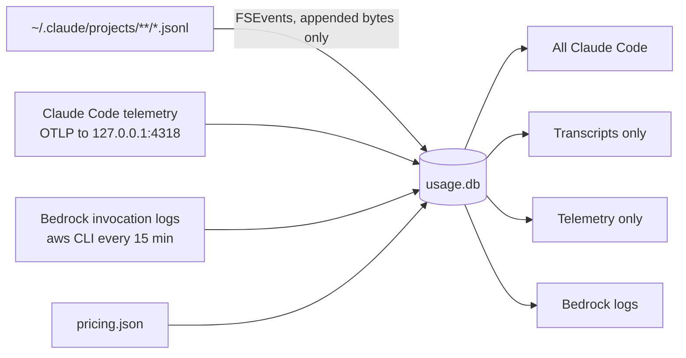

<div align="center">


# Burn

*A macOS menu-bar app that shows what Claude Code is costing you, in USD*

[](https://www.apple.com/mac/)
[](https://www.swift.org/)
[](https://github.com/JRaunak/Burn/releases/latest)

[Install](#install) • [What it shows](#what-it-shows) • [Sources](#sources) • [How cost is computed](#how-cost-is-computed) • [Troubleshooting](#troubleshooting)

</div>

Burn puts today's Claude Code spend in the menu bar. Click it for today's breakdown by project, model, and main agent vs subagents, or open History to filter any date range by project, model, session, and agent. It reads Claude Code's transcripts and, if you turn them on, its telemetry and your Bedrock invocation logs.

It uses no AI tokens and makes no network requests unless you turn on the Bedrock source. It never writes to `~/.claude`.

## Install

```sh
curl -fsSL https://raw.githubusercontent.com/JRaunak/Burn/master/install.sh | bash
```

`install.sh` downloads `Burn.tar.gz` from the [latest release](https://github.com/JRaunak/Burn/releases/latest), quits Burn if it's running, replaces `~/Applications/Burn.app`, and opens it. Releases are Apple Silicon only; on an Intel Mac the script stops and points you to building from source.

> [!WARNING]
> Releases are ad-hoc signed, not notarized. Files fetched with `curl` don't get the quarantine attribute, so Gatekeeper doesn't block the app. Downloading the same archive in a browser does set it, and macOS will then refuse to open it. Use the script.

The first time Burn runs from `/Applications` or `~/Applications`, it adds itself as a login item, and macOS shows a notification when it does. Turn it off with "Open at login" in Burn's Settings, or under System Settings > General > Login Items. A managed Mac can block login items by policy; Settings shows the error if it does. A copy run from `build/` never registers itself.

## Requirements

| Requirement | Notes |
| ----------- | ----- |
| macOS 14 or later | `LSMinimumSystemVersion` in `Resources/Info.plist`. |
| Apple Silicon | For the release build. A source build targets the Mac that builds it. |
| Claude Code | Burn reads what it writes under `~/.claude/projects`. |
| Xcode Command Line Tools | Only to build from source (`xcode-select --install`). Full Xcode and an Apple developer account aren't needed. |
| `aws` CLI | Only for the Bedrock source. |

## Build from source

```sh
git clone https://github.com/JRaunak/Burn.git
cd Burn
./build.sh install
```

| Command | What it does |
| ------- | ------------ |
| `./build.sh` | Builds release and writes an ad-hoc signed `build/Burn.app` |
| `./build.sh install` | Also quits a running Burn, copies the app to `~/Applications/Burn.app`, and opens it |
| `swift build` | Debug compile check only, no app bundle |
| `scripts/make-icon.sh` | Regenerates the app icon from `FlameGlyph.swift` (see [Icon](#icon)) |

`BURN_VERSION=0.2 ./build.sh` sets the version shown in Finder. There are no third-party dependencies; Burn links the system SQLite.

## What it shows

### Menu bar

Today's total, from local midnight. While Burn reads your transcripts for the first time it shows "Indexing…" instead, and the totals fill in as it goes. A "+" after the total means some of today's tokens have no price (see [Unpriced models](#unpriced-models)).

The flame next to the total is monochrome while nothing is being spent. It turns terracotta while usage is landing and stays that way until two minutes after the last spend. Each new charge plays one short flicker. Burn doesn't animate continuously, because on macOS 26 every status-item image change redraws the item on each menu bar, which cost about 8% CPU.

### Popover

Click the total for:

- today's and this month's totals
- the source picker (see [Sources](#sources))
- today's spend by project, by model, and main agent vs subagents, each up to six rows, with the smallest folded into "Other" so the list adds up to the total
- a warning naming any unpriced models, and any errors from pricing or a source
- History, Settings, and Quit

### History

Filters for source, date range, project, model, and agent (all, main agent, or subagents). The range starts at the first of this month and runs through today; if "To" is today, it keeps following today. Above the chart are the total, token count, active days, and unpriced tokens when there are any.

The chart shows daily cost stacked by model. Below it, the 500 most expensive sessions in the range, with start time, project, message count, subagent share, and cost. Click a session ID to filter to that session; click it again, or the "Session … ✕" button, to clear it. Closing the window resets the filters.

## Sources

Pick a source in the popover or the History window. The default, "All Claude Code", is the one to read as your cost.



| Source | What it counts |
| ------ | -------------- |
| All Claude Code | Every transcript row, plus the telemetry rows that have no matching transcript row (same session and same token counts). Those are the calls Claude Code never writes to transcripts. Without telemetry it equals the transcripts. |
| Transcripts only | What Claude Code wrote to its transcripts. On by default. |
| Telemetry only | Claude Code's own per-request cost, since you turned telemetry on. Opt-in. |
| Bedrock logs | Every Bedrock call made by your AWS identity, Claude Code included. Opt-in, uses the network. |

Bedrock logs are never added to the others, because they already include Claude Code's own calls. "Transcripts only" and "Telemetry only" are there to drill into.

### Claude Code transcripts

Burn reads `~/.claude/projects/**/*.jsonl` and never writes to `~/.claude`. It watches the folder with FSEvents and reads only what was appended since the byte offset it stored for each file. Files under a `subagents/` folder, or messages marked as sidechain, count as subagent usage.

Claude Code deletes old transcripts after its retention period, so history from before Burn's first run is limited to what was still on disk. Rows already in Burn's database stay after the files are deleted.

Calls Claude Code doesn't write to transcripts are missing, and they're real money. In one session Claude Code's own records counted 470,208 uncached Opus input tokens that its transcripts showed as 376, so Burn read about 18% under the statusline. Telemetry receives those calls, and "All Claude Code" adds them on top of the transcripts. Two different untracked calls with identical token counts in one session would count once.

### Claude Code telemetry (opt-in, localhost only)

Turn on "Listen on 127.0.0.1:4318" in Settings. Burn accepts OTLP http/json logs on that address and records the `cost_usd` of each `api_request` event, so this source uses Claude Code's own per-request cost rather than the prices in `pricing.json`. Burn doesn't change your Claude Code config. Add these to the `env` block of `~/.claude/settings.json` yourself:

```json
"env": {
  "CLAUDE_CODE_ENABLE_TELEMETRY": "1",
  "OTEL_LOGS_EXPORTER": "otlp",
  "OTEL_EXPORTER_OTLP_PROTOCOL": "http/json",
  "OTEL_EXPORTER_OTLP_ENDPOINT": "http://127.0.0.1:4318"
}
```

It covers only the time since telemetry was turned on. Telemetry events carry a short model name, so whether a request paid the regional premium is decided by the provider Claude Code is configured for (see [Regional pricing](#regional-pricing)). The main agent vs subagent split is unreliable for telemetry: Burn counts an event as subagent usage only when its `query_source` is `subagent`, and Agent SDK sessions report `sdk`.

### Bedrock invocation logs (opt-in, uses the network)

Turn on "Enabled" under Bedrock in Settings. Every 15 minutes Burn runs the installed `aws` CLI over six-hour windows since the last sync:

```sh
aws logs filter-log-events --log-group-name <log group> \
  --start-time <ms> --end-time <ms> \
  --filter-pattern '{ $.identity.arn = "*<identity>*" }' \
  --query 'events[].message' --output json \
  --profile <profile> --region <region>
```

| Setting | Default |
| ------- | ------- |
| AWS profile | `profile` in the `bedrock` block of `~/.claude/settings.json`, else `default` |
| Region | `region` in that block, else `us-east-1` |
| Log group | `/aws/bedrock/modelinvocations` |
| Identity contains | Empty. Matched against `identity.arn`. "Detect" fills it from `aws sts get-caller-identity`. |
| First sync looks back | 7 days (1 to 90) |

"Sync now" runs a sync immediately. Burn looks for `aws` only at `/opt/homebrew/bin/aws`, `/usr/local/bin/aws`, and `/usr/bin/aws`. Your identity needs read access to the log group, and an admin has to have turned on Bedrock invocation logging to it. These rows show under the project "Bedrock".

The log records contain full prompts and responses. Burn keeps only the token counts and discards the rest. CloudWatch Logs may charge for `filter-log-events` calls; this hasn't been checked, so look at your AWS pricing.

## How cost is computed

Claude Code transcripts and Bedrock logs record tokens, not dollars, so Burn prices each assistant message itself. Streaming writes the same `message.id` more than once while `output_tokens` grows, so Burn keeps one row per id with the largest `output_tokens`.

### pricing.json

Prices come from `~/Library/Application Support/Burn/pricing.json`, in USD per million tokens with `input`, `output`, `cacheWrite`, and `cacheRead` per model. Open it from Settings with "Open pricing.json". Burn re-reads it when its modification time changes, which it checks on each refresh (new usage, opening the popover, or every 5 minutes). Model keys are matched after stripping region prefixes, `anthropic.`, `[1m]`, date suffixes, and `-v1:0`, so `us.anthropic.claude-haiku-4-5-20251001-v1:0` matches `claude-haiku-4-5`.

The bundled `Resources/pricing.json` is only copied there on first run. Rebuilding Burn with a new one doesn't change the file you already have; edit it, or delete it to get the new one.

The shipped prices for Opus 5.5, Opus 4.8, Sonnet 5 and Haiku 4.5 were fitted from Claude Code's own cost-state records, so they match the cost in Claude Code's statusline. The rest come from Anthropic's pricing page, and the fitted ones match it too. All of them are list prices.

Haiku 5.5 costs more for prompts over 100,000 tokens. An `above` block in `pricing.json` gives those prices, and Burn applies them per request when input plus cache write plus cache read tokens exceed the block's `tokens`.

All cache writes are priced at the `cacheWrite` rate. 1-hour cache writes aren't priced separately.

### Unpriced models

A model with no price (missing from `pricing.json`, or set to `null`) is never counted as $0. Its tokens are reported as unpriced, the menu-bar total and session costs get a "+", and the popover names the models to add.

### Regional pricing

Regional and US-only endpoints cost 10% more than list price, and Burn works out per message whether one was used. The provider comes from the message ID (`msg_bdrk_`, `msg_vrtx_`, otherwise the Claude API):

| Provider | Charged the premium when |
| -------- | ------------------------ |
| Bedrock | The inference profile has a regional prefix (`us.`, `eu.`, `apac.` and so on) rather than `global.` |
| Claude API | `usage.inference_geo` is `us` |
| Vertex | `CLOUD_ML_REGION` is set to anything other than `global` |

Transcripts only carry the short model name, so Burn learns the full Bedrock profile IDs from `~/.claude/settings.json` (`model` and the `ANTHROPIC_*_MODEL` env vars) and from Claude Code's `cost-state` records. Settings lists the profiles it found.

Those messages are charged `regionalPremium` (1.1) times the list price. Set it to 1 in `pricing.json` to price everything at list.

## Check against your AWS bill

- Burn adds the 10% for Bedrock regional profiles such as `us.`, which Claude Code's own cost, and so its statusline, leaves out.
- Enterprise discounts aren't modelled.
- Bedrock is billed by AWS at its own published rates (https://aws.amazon.com/bedrock/pricing/), which Burn hasn't been checked against.

## Data and reset

Everything is stored in `~/Library/Application Support/Burn/usage.db`, a SQLite database with the tables `messages`, `sessions`, `prices`, `files`, and `state`. `prices` is rebuilt from `pricing.json` on every launch and edit.

"Re-read all transcripts" in Settings clears the stored file offsets and reads every transcript again. Existing rows are kept, so nothing is counted twice.

To start over, quit Burn and delete `usage.db` (and `usage.db-wal` and `usage.db-shm` if present). Burn rebuilds it from the transcripts still on disk. Usage from deleted transcripts and from the Bedrock and telemetry sources is lost.

## Troubleshooting

- macOS refuses to open Burn after a browser download. The archive is quarantined. Install with the `curl` command above instead.
- "Burn releases are Apple Silicon only." `install.sh` on an Intel Mac. Clone the repo and run `./build.sh install`.
- The total stays at "Indexing…". The first full read of `~/.claude/projects` is running. It shows only when Burn has no stored file offsets: on first run, after you delete `usage.db`, and after "Re-read all transcripts".
- A "+" after a total. Some models have no price. The popover names them; add them to `pricing.json`.
- "pricing.json: … is missing input" (or another field). Every priced model needs all four prices, and an `above` block needs `tokens` too. Until you fix it, Burn keeps the prices from the last good load; after a relaunch every model is unpriced.
- "aws CLI not found". `aws` isn't at one of the three paths Burn checks.
- "Set your AWS identity in Settings first." The Bedrock source needs "Identity contains". Use "Detect".
- "Port 4318: …" in the popover. The telemetry listener couldn't bind 127.0.0.1:4318, usually because something else is listening there.
- Telemetry is on but "Telemetry only" stays empty. Check that the `env` block above is in `~/.claude/settings.json`. Burn only listens; it doesn't turn on Claude Code's exporter.
- "Login item: …" in Settings. macOS refused the login item, usually because a managed Mac blocks them by policy.

## Icon

`FlameGlyph.swift` draws both the menu-bar flame and the app icon. After changing it, run `scripts/make-icon.sh` to regenerate `Resources/Burn.icns` and the layers in `Resources/Burn.icon`.

`Burn.icon` is a Liquid Glass icon with light and dark appearances. Compiling it needs `actool` from full Xcode, so release builds use it and builds made with the Command Line Tools fall back to the dark `Burn.icns`. `build.sh` also falls back to `Burn.icns` if `actool` fails.

## Releasing

Push a tag starting with `v`:

```sh
git tag v0.2
git push origin v0.2
```

`.github/workflows/release.yml` builds on a `macos-26` runner with Xcode 26.2, stamps the version from the tag, and attaches `Burn.tar.gz` to a GitHub release. `install.sh` always fetches the latest release.

---

<div align="center">
<sub>Built with Swift, SwiftUI, and the system SQLite.</sub>
</div>
