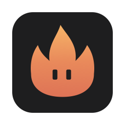
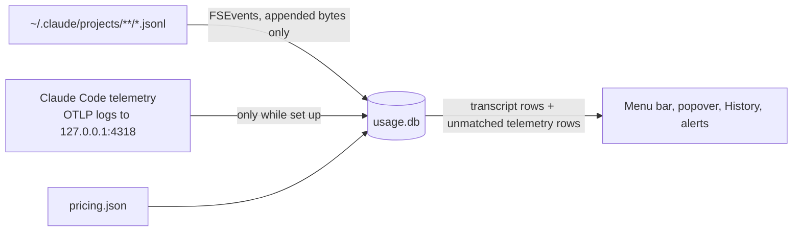

<div align="center">



# Burn

*A macOS menu-bar app that shows what Claude Code is costing you, in USD*

[](https://www.apple.com/mac/)
[](https://www.swift.org/)
[](https://github.com/JRaunak/Burn/releases/latest)

[Install](#install) • [What it shows](#what-it-shows) • [What it counts](#what-it-counts) • [Spend alerts](#spend-alerts) • [How cost is computed](#how-cost-is-computed) • [Troubleshooting](#troubleshooting)

</div>

Burn puts today's Claude Code spend in the menu bar. Click it for today's breakdown by project, model, and main agent vs subagents, or open History to filter any date range by project, model, session, and agent. It reads Claude Code's transcripts and, if you set it up, Claude Code's telemetry, and it can alert you when spend passes a daily, weekly, or monthly amount.

It uses no AI tokens and makes no network requests. Telemetry arrives on a listener bound to 127.0.0.1. Burn only reads `~/.claude`, except when you set up or remove telemetry in Settings and confirm the change.

## Install

```sh
curl -fsSL https://raw.githubusercontent.com/JRaunak/Burn/master/install.sh | bash
```

`install.sh` downloads `Burn.tar.gz` from the [latest release](https://github.com/JRaunak/Burn/releases/latest), quits Burn if it's running, replaces `~/Applications/Burn.app`, and opens it. The prebuilt app is Apple Silicon only. On an Intel Mac, or on a network that blocks GitHub's release-asset host (`release-assets.githubusercontent.com`, which some company networks do), the script downloads the same release's source from `codeload.github.com` and builds it with `build.sh` instead. That needs the Command Line Tools and takes about a minute.

> [!WARNING]
> Releases are ad-hoc signed, not notarized. Files fetched with `curl` don't get the quarantine attribute, so Gatekeeper doesn't block the app. Downloading the same archive in a browser does set it, and macOS will then refuse to open it. Use the script.

The first time Burn runs from `/Applications` or `~/Applications`, it adds itself as a login item, and macOS shows a notification when it does. Turn it off with "Open at login" in Burn's Settings, or under System Settings > General > Login Items. A managed Mac can block login items by policy; Settings shows the error if it does. A copy run from `build/` never registers itself.

### Update

Run the install command again. It installs the latest release over the old app. Your data in `~/Library/Application Support/Burn`, your Settings, and the telemetry setup in `~/.claude/settings.json` are kept. Updates never replace `pricing.json` there, so new shipped prices don't reach you on their own (see [pricing.json](#pricingjson)).

## Requirements

| Requirement | Notes |
| ----------- | ----- |
| macOS 14 or later | `LSMinimumSystemVersion` in `Resources/Info.plist`. |
| Apple Silicon | For the release build. A source build targets the Mac that builds it. |
| Claude Code | Burn reads what it writes under `~/.claude/projects`. |
| Xcode Command Line Tools | Only to build from source (`xcode-select --install`). Full Xcode and an Apple developer account aren't needed. |

## Build from source

```sh
git clone https://github.com/JRaunak/Burn.git
cd Burn
./build.sh install
```

| Command | What it does |
| ------- | ------------ |
| `./build.sh` | Builds release and writes an ad-hoc signed `build/Burn.app` |
| `./build.sh install` | Also quits a running Burn, copies the app to `~/Applications/Burn.app`, and opens it |
| `swift build` | Debug compile check only, no app bundle |
| `scripts/test.sh` | Runs the tests; extra arguments go to `swift test` |
| `scripts/make-icon.sh` | Regenerates the app icon from `FlameGlyph.swift` (see [Icon](#icon)) |

`BURN_VERSION=0.2 ./build.sh` sets the version shown in Finder. There are no third-party dependencies; Burn links the system SQLite.

Use `scripts/test.sh` rather than plain `swift test`. Under the Command Line Tools, `swift test` finds the Swift Testing macro plugin only on some clean builds, so the script passes the toolchain's plugin path to it.

## What it shows

### Menu bar

Today's total, from local midnight. While Burn reads your transcripts for the first time it shows "Indexing…" instead, and the totals fill in as it goes. A "+" after the total means some of today's tokens have no price (see [Unpriced models](#unpriced-models)).

The flame next to the total is monochrome while nothing is being spent. It turns terracotta while usage is landing and stays that way until two minutes after the last spend. Each new charge plays one short flicker. Burn doesn't animate continuously, because on macOS 26 every status-item image change redraws the item on each menu bar, which cost about 8% CPU.

### Popover

Click the total for:

- today's and this month's totals
- today's spend by project, by model, and main agent vs subagents, each up to six rows, with the smallest folded into "Other" so the list adds up to the total
- a warning naming any unpriced models, and any errors from pricing, transcripts, telemetry, or notifications
- one line saying what the totals count (see [What it counts](#what-it-counts))
- History, Settings, and Quit

### History

Filters for date range, project, model, and agent (all, main agent, or subagents). The range starts at the first of this month and runs through today; if "To" is today, it keeps following today. Above the chart are the total, token count, active days, and unpriced tokens when there are any.

The chart shows daily cost stacked by model. Below it, the 500 most expensive sessions in the range, with start time, project, message count, subagent share, and cost. Click a session ID to filter to that session; click it again, or the "Session … ✕" button, to clear it. Closing the window resets the filters.

## What it counts

Every total in Burn counts every transcript row, plus the telemetry rows that match no transcript row. Those are the calls Claude Code never writes to transcripts. Without telemetry the totals are the transcripts alone.

A request in both sources counts once, as the transcript row, which knows the project and agent. The two are matched by request id, which Claude Code writes on both the transcript line (`requestId`) and the telemetry event (`request_id`). An older transcript line without one pairs with at most one telemetry row, and only one with the same session and model, all four token counts equal, and a timestamp within 120 seconds; the nearest wins. The matched transcript row takes telemetry's cost, including $0, because telemetry knows how long each cache write lasts. Unmatched telemetry rows count at their own cost.



### Claude Code transcripts

Burn reads `~/.claude/projects/**/*.jsonl`. It watches the folder with FSEvents and reads only what was appended since the byte offset it stored for each file. Files under a `subagents/` folder, or messages marked as sidechain, count as subagent usage.

Claude Code deletes old transcripts after its retention period, so history from before Burn's first run is limited to what was still on disk. Rows already in Burn's database stay after the files are deleted.

Calls Claude Code doesn't write to transcripts are missing, and they're real money. In one session Claude Code's own records counted 470,208 uncached Opus input tokens that its transcripts showed as 376, so Burn read about 18% under the statusline. Telemetry receives those calls, and Burn adds them on top of the transcripts. Each one counts separately, even when two have identical token counts.

### Claude Code telemetry (opt-in, localhost only)

Click "Set up telemetry" under Claude Code telemetry in Settings. Burn lists the changes and asks before it writes anything. It adds only the logs keys to the `env` block of `~/.claude/settings.json`:

| Key | Value |
| --- | ----- |
| `CLAUDE_CODE_ENABLE_TELEMETRY` | `1` |
| `OTEL_LOGS_EXPORTER` | `otlp`, appended to the list if you already have exporters there |
| `OTEL_EXPORTER_OTLP_LOGS_ENDPOINT` | `http://127.0.0.1:4318/v1/logs` |
| `OTEL_EXPORTER_OTLP_LOGS_PROTOCOL` | `http/json` |

Before writing, Burn copies the file to `~/.claude/settings.json.bak-burn-<yyyyMMdd-HHmmss>`. It rewrites the file with its keys sorted, so other settings may move but keep their values. Metrics, traces, and any other collector you have configured are left as they are. If you pasted the env block from an earlier version of this README, setup also removes the generic `OTEL_EXPORTER_OTLP_ENDPOINT` (when it points at Burn) and an `OTEL_EXPORTER_OTLP_PROTOCOL` of `http/json`, because those also route metrics and traces.

The change applies to Claude Code sessions started afterwards. Burn runs its listener on 127.0.0.1:4318 only while `~/.claude/settings.json` points Claude Code's logs at it, and rechecks the file at launch, when Settings opens, and when Burn comes to the front while Settings is open.

"Remove" puts every key Burn changed back to the value it had before setup, and unsets the ones that weren't there, `CLAUDE_CODE_ENABLE_TELEMETRY` included. A key you have changed since setup is left as you set it. It also asks first and makes a backup.

Burn refuses to set up telemetry, and says why in Settings, when:

- your organization's managed settings (`/Library/Application Support/ClaudeCode/managed-settings.json`, `managed-settings.d/`, or the `com.anthropic.claudecode` managed preferences) set an OTLP endpoint, headers, client certificate, a protocol other than `http/json`, or an `OTEL_LOGS_EXPORTER` without `otlp`
- your logs already go to another OTLP endpoint, which adding Burn would replace
- `OTEL_LOGS_EXPORTER` includes `none`
- `~/.claude/settings.json` isn't valid JSON with an `env` object

Burn records the cost of each `api_request` event (`cost_usd_micros`, or `cost_usd` when that's missing), so telemetry rows, and the transcript rows they match, use Claude Code's own per-request cost rather than the prices in `pricing.json`. It covers only the time since telemetry was set up. Telemetry events carry a short model name, so whether a request paid the regional premium is decided by the provider Claude Code is configured for (see [Regional pricing](#regional-pricing)). Claude Code's cost is list price, so Burn applies the premium to it once, on the row that is counted. If `~/.claude/settings.json` has a `modelPricing` table, Claude Code prices from that instead, and Burn adds no premium to telemetry costs; it checks this at launch. The main agent vs subagent split is unreliable for telemetry: Burn counts an event as subagent usage only when its `query_source` is `subagent`, and Agent SDK sessions report `sdk`.

## Spend alerts

Set amounts in USD under Alerts in Settings: Daily, Weekly, and Monthly. An empty field is off. An amount is saved when you press Return or leave the field. Weeks start on the first weekday of your macOS region settings.

Burn checks the totals on each refresh. When a period's total reaches its amount, the alert fires once for that period, for example "$52.10 today. Over your $50 daily alert." Changing the amount re-arms it for the current period. Unpriced usage isn't in the total, and the alert adds "Plus unpriced usage." when there is some.

Each alert arrives two ways:

| | macOS notification | Burn's banner |
| - | ------------------ | ------------- |
| Where | Notification Center | Top-right of the display where you last clicked Burn, one per period |
| Needs permission | Yes. macOS may not show a permission prompt for an ad-hoc signed app, so switch Burn on in System Settings > Notifications. Settings > Alerts shows the current state and has an "Open System Settings" button. | No |
| During screen sharing or Focus | Hidden by macOS | Shown, unless you turn on "Hide banner when sharing the screen" (off by default) |
| Sound | None | Burn plays the chosen sound once each time alerts fire |

The banner closes after 8 seconds (15 with VoiceOver on), stays while the pointer is over it, and has a close button on hover. Clicking it opens History for that period.

"Sound" lists the system sounds in `/System/Library/Sounds` (default Glass, or None) and plays the one you pick. "Send test notification" sends a sample daily alert both ways, with the sound.

## How cost is computed

Claude Code transcripts record tokens, not dollars, so Burn prices each assistant message itself. Streaming writes the same `message.id` more than once while `output_tokens` grows, so Burn keeps one row per id with the largest `output_tokens`.

### pricing.json

Prices come from `~/Library/Application Support/Burn/pricing.json`, in USD per million tokens with `input`, `output`, `cacheWrite` (5-minute cache writes), `cacheWrite1h` (1-hour cache writes), and `cacheRead` per model. Open it from Settings with "Open pricing.json". Burn re-reads it when its modification time changes, which it checks on each refresh (new usage, opening the popover, or every 5 minutes). Model keys are matched after stripping region prefixes, `anthropic.`, `[1m]`, date suffixes, and `-v1:0`, so `us.anthropic.claude-haiku-4-5-20251001-v1:0` matches `claude-haiku-4-5`.

The bundled `Resources/pricing.json` is only copied there when the file doesn't exist. Updating or rebuilding Burn with a new one doesn't change the file you already have; edit it, or delete it to get the new one.

The shipped prices are list prices from Anthropic's pricing page. For Opus 5.5, Opus 4.8, Sonnet 5 and Haiku 4.5, the input, output, 5-minute write, and read prices were also fitted from Claude Code's own cost-state records and match the page. The 1-hour write prices come from the page only.

Haiku 5.5 costs more for prompts over 100,000 tokens. An `above` block in `pricing.json` gives those prices, and Burn applies them per request when input plus cache write plus cache read tokens exceed the block's `tokens`.

Transcripts split each message's cache writes into 5-minute and 1-hour, and Burn stores and prices the two separately. A model without `cacheWrite1h` (in its `above` block too) uses 2 × its `input` price, Anthropic's documented multiplier, so an older `pricing.json` needs no edit. Burn re-reads the transcripts still on disk to fill in the split; rows whose transcript is already gone, and lines with no breakdown, count all their writes as 5-minute. Telemetry reports no split, but its cost already reflects it, which is why a matched row takes telemetry's cost.

### Unpriced models

A model with no price (missing from `pricing.json`, or set to `null`) is never counted as $0. Unless telemetry reported a cost for the request, its tokens are reported as unpriced, the menu-bar total and session costs get a "+", and the popover names the models to add.

### Regional pricing

Regional and US-only endpoints cost 10% more than list price, and Burn works out per message whether one was used. The provider comes from the message ID (`msg_bdrk_`, `msg_vrtx_`, otherwise the Claude API):

| Provider | Charged the premium when |
| -------- | ------------------------ |
| Bedrock | The inference profile has a regional prefix (`us.`, `eu.`, `apac.` and so on) rather than `global.` |
| Claude API | `usage.inference_geo` is `us` |
| Vertex | `CLOUD_ML_REGION` is set to anything other than `global` |

Transcripts only carry the short model name, so Burn learns the full Bedrock profile IDs from `~/.claude/settings.json` (`model` and the `ANTHROPIC_*_MODEL` env vars) and from Claude Code's `cost-state` records. Settings lists the profiles it found.

Those messages are charged `regionalPremium` (1.1) times the list price. Set it to 1 in `pricing.json` to price everything at list.

## Check against your AWS bill

- Burn adds the 10% for Bedrock regional profiles such as `us.`, which Claude Code's own cost, and so its statusline, leaves out.
- Enterprise discounts aren't modelled.
- Bedrock is billed by AWS at its own published rates (https://aws.amazon.com/bedrock/pricing/), which Burn hasn't been checked against.

## Data and reset

Everything is stored in `~/Library/Application Support/Burn/usage.db`, a SQLite database with the tables `messages`, `sessions`, `prices`, `files`, and `state`. `prices` is rebuilt from `pricing.json` on every launch and edit.

"Re-read all transcripts" in Settings clears the stored file offsets and reads every transcript again. Existing rows are kept, so nothing is counted twice.

To start over, quit Burn and delete `usage.db` (and `usage.db-wal` and `usage.db-shm` if present). Burn rebuilds it from the transcripts still on disk. Usage from deleted transcripts and from telemetry is lost.

## Troubleshooting

- macOS refuses to open Burn after a browser download. The archive is quarantined. Install with the `curl` command above instead.
- "Building from source needs the Command Line Tools." The prebuilt download failed (Intel Mac, or a blocked release host) and the source fallback has no compiler. Run `xcode-select --install`, then the install command again.
- The total stays at "Indexing…". The first full read of `~/.claude/projects` is running. It shows only when Burn has no stored file offsets: on first run, after you delete `usage.db`, after "Re-read all transcripts", and after an update whose database change re-reads every transcript.
- A "+" after a total. Some models have no price. The popover names them; add them to `pricing.json`.
- "pricing.json: … is missing input" (or another field). Every priced model needs `input`, `output`, `cacheWrite`, and `cacheRead` (`cacheWrite1h` is optional), and an `above` block needs `tokens` too. Until you fix it, Burn keeps the prices from the last good load; after a relaunch every model is unpriced.
- "Can't listen on 127.0.0.1:4318: …" in the popover or Settings. Something else holds the port. `lsof -nP -iTCP:4318 -sTCP:LISTEN` shows what; stop it, or remove Burn's telemetry setup.
- Telemetry is set up but adds nothing. It applies only to Claude Code sessions started after setup; restart the session.
- "Your organization's managed settings control Claude Code telemetry, so Burn can't receive it." Managed settings win over `~/.claude/settings.json`, and Burn doesn't touch them. The totals are the transcripts alone.
- "Claude Code already sends its logs to …; adding Burn would replace that." Claude Code sends logs to one OTLP endpoint, and you already have one. Burn won't take it over.
- "OTEL_LOGS_EXPORTER in ~/.claude/settings.json includes "none", …". Remove `none` yourself if you want Claude Code's logs, then set up again.
- "~/.claude/settings.json isn't valid JSON with an "env" object, so Burn won't edit it." Fix the file; Burn won't rewrite one it can't parse.
- "Couldn't change ~/.claude/settings.json: …" in Settings. The file couldn't be read, backed up, or written, and the message gives the error. Burn writes atomically, so the file is left as it was.
- "Notifications are turned off for Burn." in Settings > Alerts, or no macOS notification. Turn Burn on in System Settings > Notifications > Burn. Burn's own banner shows either way.
- "Notification not sent: …" in the popover or Settings. macOS refused the notification; check System Settings > Notifications > Burn.
- An alert's macOS notification didn't show while sharing the screen or in Focus. macOS hides it then. Burn's banner still shows unless "Hide banner when sharing the screen" is on.
- "Login item: …" in Settings. macOS refused the login item, usually because a managed Mac blocks them by policy.

## Icon

`FlameGlyph.swift` draws both the menu-bar flame and the app icon. After changing it, run `scripts/make-icon.sh` to regenerate `Resources/Burn.icns` and the layers in `Resources/Burn.icon`.

`Burn.icon` is a Liquid Glass icon with light and dark appearances. Compiling it needs `actool` from full Xcode, so release builds use it and builds made with the Command Line Tools fall back to the dark `Burn.icns`. `build.sh` also falls back to `Burn.icns` if `actool` fails.

## Releasing

Push a tag starting with `v`:

```sh
git tag v0.2
git push origin v0.2
```

`.github/workflows/release.yml` builds on a `macos-26` runner with Xcode 26.2, stamps the version from the tag, and attaches `Burn.tar.gz` to a GitHub release. `install.sh` always fetches the latest release.

---

<div align="center">
<sub>Built with Swift, SwiftUI, and the system SQLite.</sub>
</div>
